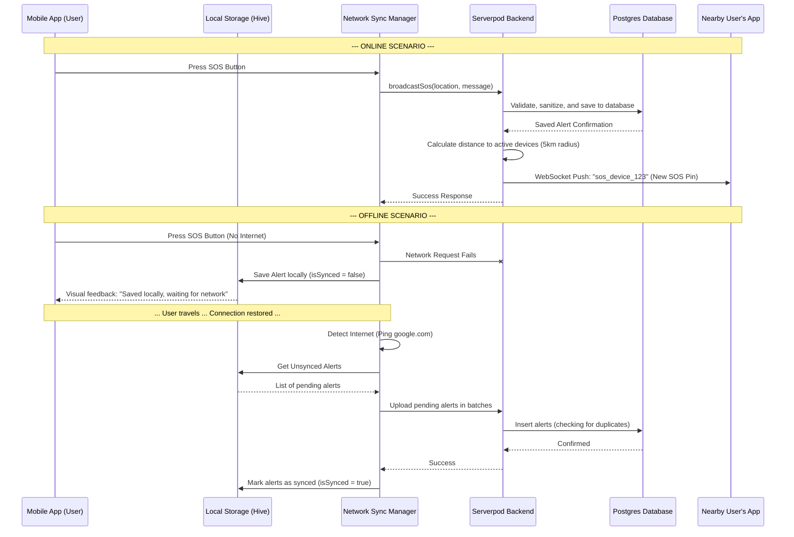

# Crisis Link: App Architecture Explained

## 1. High-Level Executive Summary
Crisis Link is an emergency SOS alert platform designed to function reliably in both connected and disconnected environments. 

Think of it like a smart walkie-talkie network combined with a secure local diary:
*   **The Frontend (Flutter):** The smart walkie-talkie app on your phone. It displays the map, tracks your location, and provides the buttons to ask for help or offer assistance.
*   **The Backend (Serverpod + Postgres):** The central dispatch headquarters. It receives cries for help, figures out who is nearby, and routes the alerts to their walkie-talkies.
*   **The Interaction:** The phone constantly chats with headquarters via real-time WebSockets (for live updates like "rescue on the way") and standard API calls (for fetching bulk data). If the connection to headquarters drops, the phone acts as a secure local diary, saving your SOS calls until it can reach headquarters again.

## 2. The Online Journey (Step-by-Step Walkthrough)
When you have an active internet connection and press the SOS button:

*   **Step 1: On the Mobile Screen:** You press the SOS button. The app immediately updates your screen to show that an alert is being sent and triggers a Wakelock (keeping your screen awake for a short period).
*   **Step 2: Packaging the Data:** The app gathers your precise GPS coordinates (using `geolocator`), your message, your name, and a unique ID for this specific alert (`clientAlertId`). 
*   **Step 3: Sending to Headquarters:** The app hands this package to the `NetworkSyncManager`, which uses the Serverpod Client to send it to the server. It uses a standard RPC (Remote Procedure Call) to send the SOS, but keeps a WebSocket stream open to listen for live responses.
*   **Step 4: Headquarters Processing:** 
    *   The Serverpod backend (`SosEndpoint.broadcastSos`) receives the package. 
    *   It strictly sanitizes the data (e.g., ensuring your message isn't maliciously long).
    *   It checks for duplicates to ensure it doesn't process the same SOS twice (Idempotency).
    *   It permanently records the SOS in the PostgreSQL database.
    *   It then acts as a radar: calculating the distance between you and every other active device using the Haversine formula.
*   **Step 5: The Return Trip:** The server identifies all active devices within a 5-kilometer radius. It uses WebSockets (a live, open pipeline) to instantly push the alert directly to the specific channels of those nearby devices. Your app also listens on this live pipeline for updates like "Rescue Claimed."

## 3. The Offline Journey (Current Implementation Reality Check)
What happens if you trigger an SOS in airplane mode or deep in the woods with zero connectivity?

*   **Local Storage:** The app does *not* fail or throw an exception. Instead, it writes the SOS into a secure local notebook on the device. This is implemented using **Hive** (a fast, local NoSQL database), and the notebook is locked with an encryption key stored in the phone's **Secure Storage**.
*   **Queueing Mechanism:** The app queues the actions. The `NetworkSyncManager` constantly watches your phone's network status. The local Hive box can hold up to 1,000 alerts. If it exceeds 1,000, it safely deletes the oldest *already synced* alerts to make room. 
*   **Restart Resilience:** If you completely close the app or restart your phone while offline, your SOS is safe. Because it was written to the Hive database on the phone's hard drive (not just temporary memory), the app will simply pick up where it left off upon restart and try to send the SOS again once the internet returns.
*   **Reconnection:** The moment your phone reconnects to a network (verifying connection by pinging google.com), the `NetworkSyncManager` grabs all unsynced alerts from Hive and uploads them in small batches to avoid overwhelming the server, utilizing built-in retry logic if the server is busy.

## 4. Methodology & Tech Stack Mapping

| Tech Concept | Crisis Link Implementation | Layman's Analogy |
| :--- | :--- | :--- |
| **Client State Management** | `ValueNotifier` (Built-in Flutter) | **The Bulletin Board:** A local noticeboard in the app. When a new SOS comes in, the manager pins a note, and the screen automatically updates to look at the new note. |
| **Local Storage / Caching** | `Hive` + `Flutter Secure Storage` | **The Locked Filing Cabinet:** A highly secure, physical notebook kept on the phone where alerts wait patiently when there's no internet. |
| **Network Communication** | Serverpod Client API & WebSockets | **The Walkie-Talkie & Mail Service:** WebSockets act like an open Walkie-Talkie channel for instant pushes, while the API acts like the postal service for dropping off structured SOS packages. |
| **Database Persistence** | Serverpod ORM + PostgreSQL | **The Grand Archive:** A massive, organized, permanent filing room at headquarters that remembers every SOS ever made. |

## 5. Visual Flow Diagram (Mermaid)

