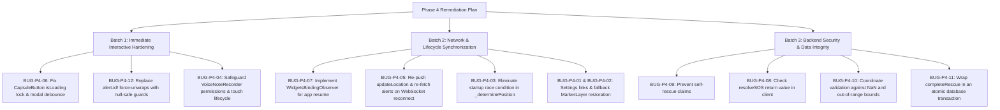

# Phase 4 Codebase Audit: Crsis_Link

**Audit Type:** Comprehensive Deep-Scan Diagnostic (Edge Cases, Concurrency, Lifecycle, Backend Payload Security)  
**System Under Test:** "Crsis_Link" (Client & Serverpod Backend)  
**Lead Auditors:** Principal Software Architect & Lead QA Engineer  
**Date:** October 2, 2026  

---

## Executive Summary

Following the Phase 3 audit and resolution of database transaction boundaries, memory leaks, and streaming listeners, this Phase 4 diagnostic audited the edge-case resilience, real-world networking fault tolerance, user interaction concurrency, and security payload validation of Crsis_Link.

A total of **12 critical architectural defects** were identified across the Flutter client (`lib/`) and Serverpod backend (`crsis_link_server/`):
- **5 Critical Edge Cases** (unrecoverable geolocation failure states, hidden map pins, audio permission race conditions, and spatial cache blackouts).
- **2 Concurrency / Race Conditions** (broken `CapsuleButton` loading lock permitting double-tap spamming, and total absence of background/foreground lifecycle synchronization).
- **5 Backend Validation & State Desynchronization Gaps** (unvalidated client resolutions, self-rescue hijacking, coordinate `NaN` corruption, non-transactional completion endpoints, and unsafe client force-unwraps).

---

## Audit Findings Matrix

| ID | Category | Severity | Component | File | Lines | Summary |
|---|---|---|---|---|---|---|
| **BUG-P4-01** | Edge Case | **High** | Flutter Client | [home_map_screen.dart](file:///c:/Users/shahu/Desktop/Crsis_Link/lib/presentation/screens/home_map_screen.dart#L213-L287), [sos_screen.dart](file:///c:/Users/shahu/Desktop/Crsis_Link/lib/presentation/screens/sos_screen.dart#L52-L66) | 213–287, 52–66 | Unrecoverable location permissions & no settings recovery link |
| **BUG-P4-02** | Edge Case | **High** | Flutter Client | [home_map_screen.dart](file:///c:/Users/shahu/Desktop/Crsis_Link/lib/presentation/screens/home_map_screen.dart#L529-L593) | 529–593 | Missing `MarkerLayer` in fallback map hides active emergency signals |
| **BUG-P4-03** | Edge Case | **High** | Flutter Client | [home_map_screen.dart](file:///c:/Users/shahu/Desktop/Crsis_Link/lib/presentation/screens/home_map_screen.dart#L39-L40) | 39–40, 198–202 | Startup race condition silently drops initial radar pin fetch |
| **BUG-P4-04** | Edge Case | **Medium** | Flutter Client | [voice_note_recorder.dart](file:///c:/Users/shahu/Desktop/Crsis_Link/lib/presentation/widgets/voice_note_recorder.dart#L62-L75) | 62–75, 265–268 | Unguarded native audio permission & orphaned recording session |
| **BUG-P4-05** | Edge Case | **Critical** | Backend / Client | [sos_endpoint.dart](file:///c:/Users/shahu/Desktop/Crsis_Link/crsis_link_server/lib/src/endpoints/sos_endpoint.dart#L46-L56), [home_map_screen.dart](file:///c:/Users/shahu/Desktop/Crsis_Link/lib/presentation/screens/home_map_screen.dart#L86-L103) | 46–56, 86–103 | WebSocket disconnect purges spatial cache; client never resyncs coordinates or alerts |
| **BUG-P4-06** | Concurrency | **Critical** | Flutter Client | [capsule_button.dart](file:///c:/Users/shahu/Desktop/Crsis_Link/lib/presentation/widgets/capsule_button.dart#L48-L62), [home_map_screen.dart](file:///c:/Users/shahu/Desktop/Crsis_Link/lib/presentation/screens/home_map_screen.dart#L371-L417) | 48–62, 371–417, 795–860 | `CapsuleButton` ignores `isLoading`, allowing duplicate SOS dispatches & claims |
| **BUG-P4-07** | Concurrency | **High** | Flutter Client | [main.dart](file:///c:/Users/shahu/Desktop/Crsis_Link/lib/main.dart#L27-L41), [home_map_screen.dart](file:///c:/Users/shahu/Desktop/Crsis_Link/lib/presentation/screens/home_map_screen.dart#L23-L56) | 27–41, 23–56 | Zero `WidgetsBindingObserver` lifecycle sync on app resume |
| **BUG-P4-08** | Backend Gap | **High** | Backend / Client | [sos_endpoint.dart](file:///c:/Users/shahu/Desktop/Crsis_Link/crsis_link_server/lib/src/endpoints/sos_endpoint.dart#L196-L210), [home_map_screen.dart](file:///c:/Users/shahu/Desktop/Crsis_Link/lib/presentation/screens/home_map_screen.dart#L802-L808) | 196–210, 802–808 | Client ignores `resolveSOS` boolean return, falsely reporting success on failed server calls |
| **BUG-P4-09** | Backend Gap | **High** | Serverpod Backend | [sos_endpoint.dart](file:///c:/Users/shahu/Desktop/Crsis_Link/crsis_link_server/lib/src/endpoints/sos_endpoint.dart#L213-L238) | 213–238 | Victim can claim their own rescue signal (`volunteerDeviceId == deviceId`) |
| **BUG-P4-10** | Backend Gap | **Medium** | Serverpod Backend | [sos_endpoint.dart](file:///c:/Users/shahu/Desktop/Crsis_Link/crsis_link_server/lib/src/endpoints/sos_endpoint.dart#L96-L127) | 96–127, 180–184 | Unchecked coordinates, `NaN`, and infinity break Haversine and bounding box SQL |
| **BUG-P4-11** | Backend Gap | **Medium** | Serverpod Backend | [sos_endpoint.dart](file:///c:/Users/shahu/Desktop/Crsis_Link/crsis_link_server/lib/src/endpoints/sos_endpoint.dart#L241-L256) | 241–256 | `completeRescue` lacks transaction isolation, vulnerable to race conditions |
| **BUG-P4-12** | Backend Gap | **Medium** | Flutter Client | [home_map_screen.dart](file:///c:/Users/shahu/Desktop/Crsis_Link/lib/presentation/screens/home_map_screen.dart#L802-L884) | 802–884 | Unsafe force-unwraps on `alert.id!` trigger fatal null-check operator exceptions |

---

## Detailed Audit Analyses

---

### Group 1: Critical Edge Cases & Error Handling

#### BUG-P4-01: Permanent Permission Traps & Lack of Settings Redirection
- **Location:** [home_map_screen.dart:213-287](file:///c:/Users/shahu/Desktop/Crsis_Link/lib/presentation/screens/home_map_screen.dart#L213-L287) and [sos_screen.dart:52-66](file:///c:/Users/shahu/Desktop/Crsis_Link/lib/presentation/screens/sos_screen.dart#L52-L66)
- **Root Cause:** Both screens verify location status via `Geolocator.checkPermission()`. When the user denies permission permanently (`LocationPermission.deniedForever`) or disables the device GPS hardware (`!serviceEnabled`), the code throws a generic Dart `Exception`. 
- **Impact:** 
  - On `HomeMapScreen`, the error card displays "Location permissions permanently denied" with a "RETRY GPS" button. Tapping the button re-invokes `_determinePosition()`, which immediately encounters `deniedForever` again in an unbreakable loop.
  - On `SosScreen`, tapping the SOS button outputs a 4-second SnackBar. The user cannot trigger an emergency broadcast or navigate to app settings.
- **Architectural Remedy:**
  - Introduce explicit checks for `deniedForever` and `!serviceEnabled`.
  - Provide actionable SnackBars / Dialog buttons linking to `Geolocator.openAppSettings()` and `Geolocator.openLocationSettings()`.

```dart
// Recommended remediation pattern:
if (!serviceEnabled) {
  ScaffoldMessenger.of(context).showSnackBar(SnackBar(
    content: const Text('Location services are disabled.'),
    action: SnackBarAction(label: 'SETTINGS', onPressed: Geolocator.openLocationSettings),
  ));
  return;
}
if (permission == LocationPermission.deniedForever) {
  ScaffoldMessenger.of(context).showSnackBar(SnackBar(
    content: const Text('Location permissions permanently denied.'),
    action: SnackBarAction(label: 'APP SETTINGS', onPressed: Geolocator.openAppSettings),
  ));
  return;
}
```

---

#### BUG-P4-02: Hidden Radar Pins in GPS Fallback View
- **Location:** [home_map_screen.dart:529-593](file:///c:/Users/shahu/Desktop/Crsis_Link/lib/presentation/screens/home_map_screen.dart#L529-L593)
- **Root Cause:** In `HomeMapScreen.build()`, when `_currentLocation != null` (line 446), `FlutterMap` renders both the dark tile layer and `MarkerLayer` containing all active SOS pins. However, in the `else` branch (lines 529–593), `FlutterMap` **only contains the tile layer and error card**.
- **Impact:** If a user’s GPS is temporarily disabled, denied, or slow to resolve, the map renders with **zero pins**. Responders who know an emergency is occurring nearby cannot see active pins on the map unless their own GPS has a 100% active fix.
- **Architectural Remedy:**
  - Unify `FlutterMap` into a single declarative tree where `MarkerLayer` is always mounted, rendering active pins regardless of whether `_currentLocation` is available.

---

#### BUG-P4-03: Startup Race Condition Silently Drops Initial Pin Fetch
- **Location:** [home_map_screen.dart:39-40, 198-202](file:///c:/Users/shahu/Desktop/Crsis_Link/lib/presentation/screens/home_map_screen.dart#L39-L40)
- **Root Cause:** In `initState()`, `_determinePosition()` and `_fetchActiveSos()` are fired concurrently. `_currentLocation` is null when `_fetchActiveSos()` starts. At lines 198–202:
  ```dart
  final position = await Geolocator.getCurrentPosition(
      locationSettings: const LocationSettings(accuracy: LocationAccuracy.low));
  ```
  This is executed **before** `_determinePosition()` has prompted the user for permission. On a clean launch, `Geolocator.getCurrentPosition()` throws a `PermissionDeniedException`, which is caught at line 208 (`debugPrint('Error fetching SOS pins: $e')`) and silently discarded. Once permission is subsequently granted in `_determinePosition()`, `_fetchActiveSos()` is **never called again**.
- **Impact:** The radar map displays 0 pins on launch, requiring the user to manually guess that they must tap the manual refresh button.
- **Architectural Remedy:**
  - Call `_fetchActiveSos()` inside `_determinePosition()` immediately after `_currentLocation` is resolved and stored.

---

#### BUG-P4-04: Audio Permission Exception & Orphaned Hardware Recording
- **Location:** [voice_note_recorder.dart:62-75, 265-268](file:///c:/Users/shahu/Desktop/Crsis_Link/lib/presentation/widgets/voice_note_recorder.dart#L62-L75)
- **Root Cause:**
  1. `_startRecording()` calls `await _recorder.hasPermission()` without a `try-catch` block. If the platform channel encounters an OS-level lockout or security exception, it throws an uncaught `PlatformException`.
  2. `GestureDetector` triggers `onTapDown: (_) => _startRecording()` and `onTapUp: (_) { if (_isRecording) _stopRecording(); }`. If the user taps briefly, `onTapUp` executes while `_startRecording()` is still awaiting the OS permission dialog. `_isRecording` is still `false`, so `_stopRecording()` does nothing. When the permission resolves, `_startRecording()` starts the hardware recorder and sets `_isRecording = true` with no finger on the screen.
- **Impact:** The phone starts recording an unprompted 10-second audio clip in the background.
- **Architectural Remedy:**
  - Wrap `_startRecording()` in a robust `try-catch` block.
  - Implement a cancellation flag (`bool _isTapCancelled`) so that if `onTapUp` fires before recording initialization finishes, recording is immediately aborted.

---

#### BUG-P4-05: Spatial Cache Purge upon WebSocket Drop (2-Minute Blackout)
- **Location:** [sos_endpoint.dart:46-56](file:///c:/Users/shahu/Desktop/Crsis_Link/crsis_link_server/lib/src/endpoints/sos_endpoint.dart#L46-L56) and [home_map_screen.dart:86-103](file:///c:/Users/shahu/Desktop/Crsis_Link/lib/presentation/screens/home_map_screen.dart#L86-L103)
- **Root Cause:**
  1. In [sos_endpoint.dart:54](file:///c:/Users/shahu/Desktop/Crsis_Link/crsis_link_server/lib/src/endpoints/sos_endpoint.dart#L54), `streamClosed` executes `_deviceLocations.remove(deviceId)`.
  2. In [home_map_screen.dart:92-103](file:///c:/Users/shahu/Desktop/Crsis_Link/lib/presentation/screens/home_map_screen.dart#L92-L103), `_bindStream()` sends a `Greeting` on reconnect, but **never pushes `updateLocation`**.
  3. Serverpod MessageCentral does not buffer messages. Any broadcast sent while the WebSocket is disconnected is dropped for that client.
- **Impact:** 
  - The client's coordinates remain completely absent from `_deviceLocations` for up to 2 minutes (until `_heartbeatTimer` fires at line 45), leaving the user completely blind to spatial broadcasts.
  - Any SOS claimed, resolved, or broadcast during network reconnect is never delivered to the client because `_bindStream()` does not invoke `_fetchActiveSos()`.
- **Architectural Remedy:**
  - Inside `_bindStream()`, immediately call `AuthManager.client.sos.updateLocation` if `_currentLocation != null`.
  - Inside `_onStreamingConnectionStatusChanged()`, invoke `_fetchActiveSos()` whenever the connection returns to `StreamingConnectionStatus.connected`.

---

### Group 2: Concurrency & State Desynchronization

#### BUG-P4-06: `CapsuleButton` Ignores `isLoading`, Allowing Multi-Tap Spamming
- **Location:** [capsule_button.dart:48-62](file:///c:/Users/shahu/Desktop/Crsis_Link/lib/presentation/widgets/capsule_button.dart#L48-L62), [home_map_screen.dart:371-417](file:///c:/Users/shahu/Desktop/Crsis_Link/lib/presentation/screens/home_map_screen.dart#L371-L417), [sos_screen.dart:182-230](file:///c:/Users/shahu/Desktop/Crsis_Link/lib/presentation/screens/sos_screen.dart#L182-L230)
- **Root Cause:** In [capsule_button.dart:59-62](file:///c:/Users/shahu/Desktop/Crsis_Link/lib/presentation/widgets/capsule_button.dart#L59-L62):
  ```dart
  onPressed: () {
    HapticFeedback.lightImpact();
    onPressed();
  },
  ```
  The native `ElevatedButton.onPressed` is **never assigned `null` when `isLoading == true`**. It only changes the child widget to a `CircularProgressIndicator`.
  Furthermore, the modal action callbacks for "BROADCAST SOS", "ACCEPT RESCUE", and "RESOLVE / CLEAR SOS" do not check `if (isSubmitting) return;`.
- **Impact:** Frantic double-taps on "ACCEPT RESCUE" execute parallel calls. The first succeeds; the second crashes on `SOS alert is already claimed or resolved`, showing a red failure SnackBar to the rescuer. On "BROADCAST SOS", frantic taps generate duplicate database records.
- **Architectural Remedy:**
  - Update `CapsuleButton`:
    ```dart
    onPressed: isLoading ? null : () {
      HapticFeedback.lightImpact();
      onPressed();
    },
    ```
  - Add guard clauses `if (isSubmitting) return;` at the beginning of every action callback.

---

#### BUG-P4-07: Total Absence of App Lifecycle Synchronization
- **Location:** [main.dart:27-41](file:///c:/Users/shahu/Desktop/Crsis_Link/lib/main.dart#L27-L41), [main_navigation.dart:20-48](file:///c:/Users/shahu/Desktop/Crsis_Link/lib/presentation/screens/main_navigation.dart#L20-L48), [home_map_screen.dart:23-56](file:///c:/Users/shahu/Desktop/Crsis_Link/lib/presentation/screens/home_map_screen.dart#L23-L56)
- **Root Cause:** The application contains zero implementations of `WidgetsBindingObserver` or `didChangeAppLifecycleState`.
- **Impact:** When a user backgrounds the app (e.g. locks the phone or switches apps) and resumes after several minutes, the OS often terminates the TCP socket. The client maintains an in-memory stale list of pins. It never re-checks GPS, never re-syncs active alerts via `getActiveAlerts()`, and fails to detect dropped pins.
- **Architectural Remedy:**
  - Implement `WidgetsBindingObserver` in `HomeMapScreenState`:
    ```dart
    @override
    void didChangeAppLifecycleState(AppLifecycleState state) {
      if (state == AppLifecycleState.resumed) {
        _determinePosition();
        _fetchActiveSos();
        if (AuthManager.client.streamingConnectionStatus != StreamingConnectionStatus.connected) {
          AuthManager.client.openStreamingConnection();
        }
      }
    }
    ```

---

### Group 3: Backend Validation Gaps & Security Hazards

#### BUG-P4-08: Client-Side Discard of `resolveSOS` Status
- **Location:** [sos_endpoint.dart:196-210](file:///c:/Users/shahu/Desktop/Crsis_Link/crsis_link_server/lib/src/endpoints/sos_endpoint.dart#L196-L210) and [home_map_screen.dart:802-808](file:///c:/Users/shahu/Desktop/Crsis_Link/lib/presentation/screens/home_map_screen.dart#L802-L808)
- **Root Cause:** In [home_map_screen.dart:802](file:///c:/Users/shahu/Desktop/Crsis_Link/lib/presentation/screens/home_map_screen.dart#L802):
  ```dart
  await AuthManager.client.sos.resolveSOS(alert.id!, AuthManager.deviceId);
  if (ctx.mounted) {
    Navigator.pop(ctx);
    widget.onResolve(alert.id!);
    ScaffoldMessenger.of(context).showSnackBar(const SnackBar(content: Text('SOS Resolved / Cleared.')));
  }
  ```
  The boolean result of `resolveSOS` is completely ignored. If `resolveSOS` returns `false` (e.g. record does not exist or device ID does not match), the client removes the pin locally and displays a success notification.
- **Impact:** The victim believes their emergency alert was removed, but it remains permanently active on the server and visible to all other responders.
- **Architectural Remedy:**
  - Check the returned boolean:
    ```dart
    final success = await AuthManager.client.sos.resolveSOS(alert.id!, AuthManager.deviceId);
    if (!success) throw Exception('Unable to resolve SOS. Record not found or unauthorized.');
    ```

---

#### BUG-P4-09: Self-Rescue Claim Vulnerability
- **Location:** [sos_endpoint.dart:213-238](file:///c:/Users/shahu/Desktop/Crsis_Link/crsis_link_server/lib/src/endpoints/sos_endpoint.dart#L213-L238)
- **Root Cause:** `claimRescue` checks `targetAlert.status != 'OPEN'`, but **does not check if `targetAlert.deviceId == volunteerDeviceId`**.
- **Impact:** A victim or buggy client can accept their own SOS alert as a volunteer, changing its status to `CLAIMED`. Once claimed by the victim themselves, real volunteers will see "Rescue on the way" and will not respond, abandoning the victim.
- **Architectural Remedy:**
  - Add guard:
    ```dart
    if (targetAlert.deviceId == volunteerDeviceId) {
      throw Exception('You cannot claim your own SOS request.');
    }
    ```

---

#### BUG-P4-10: Unchecked Coordinate Boundaries & `NaN` Arithmetic
- **Location:** [sos_endpoint.dart:96-127, 173-191](file:///c:/Users/shahu/Desktop/Crsis_Link/crsis_link_server/lib/src/endpoints/sos_endpoint.dart#L96-L127)
- **Root Cause:** `broadcastSos` and `updateLocation` accept `double latitude, double longitude` without checking `isNaN`, `isInfinite`, or valid ranges `[-90, 90]` and `[-180, 180]`.
- **Impact:** Inserting `NaN` into PostgreSQL causes bounding-box queries in `getActiveAlerts` (`latitude.between(minLat, maxLat)`) to fail or return database errors.
- **Architectural Remedy:**
  - Add input validation in `broadcastSos` and `updateLocation`:
    ```dart
    if (latitude.isNaN || longitude.isNaN || latitude < -90 || latitude > 90 || longitude < -180 || longitude > 180) {
      throw FormatException('Invalid GPS coordinates provided.');
    }
    ```

---

#### BUG-P4-11: Non-Transactional `completeRescue` Endpoint
- **Location:** [sos_endpoint.dart:241-256](file:///c:/Users/shahu/Desktop/Crsis_Link/crsis_link_server/lib/src/endpoints/sos_endpoint.dart#L241-L256)
- **Root Cause:** While `claimRescue` was secured in a database transaction, `completeRescue` performs an isolated `findById` and `updateRow` without a transaction wrapper.
- **Impact:** Concurrent network retries or conflicting client updates can produce race conditions and stale writes.
- **Architectural Remedy:**
  - Wrap `completeRescue` in `session.db.transaction((transaction) async { ... })`.

---

#### BUG-P4-12: Unsafe Force-Unwraps on `alert.id!` in Client Actions
- **Location:** [home_map_screen.dart:802, 805, 829, 867, 881, 884](file:///c:/Users/shahu/Desktop/Crsis_Link/lib/presentation/screens/home_map_screen.dart#L802)
- **Root Cause:** All interactive marker buttons execute `alert.id!` directly. In Serverpod, `SosAlert.id` is typed as `int?`.
- **Impact:** If a malformed alert or unsaved entity without an ID enters the pipeline, tapping any action crashes the Flutter runtime with `_CastError: Null check operator used on a null value`.
- **Architectural Remedy:**
  - Provide a safe guard before accessing `alert.id`:
    ```dart
    final alertId = alert.id;
    if (alertId == null) {
      ScaffoldMessenger.of(ctx).showSnackBar(const SnackBar(content: Text('Error: Invalid Alert ID.')));
      return;
    }
    ```

---

## Recommended Patch Sequencing


